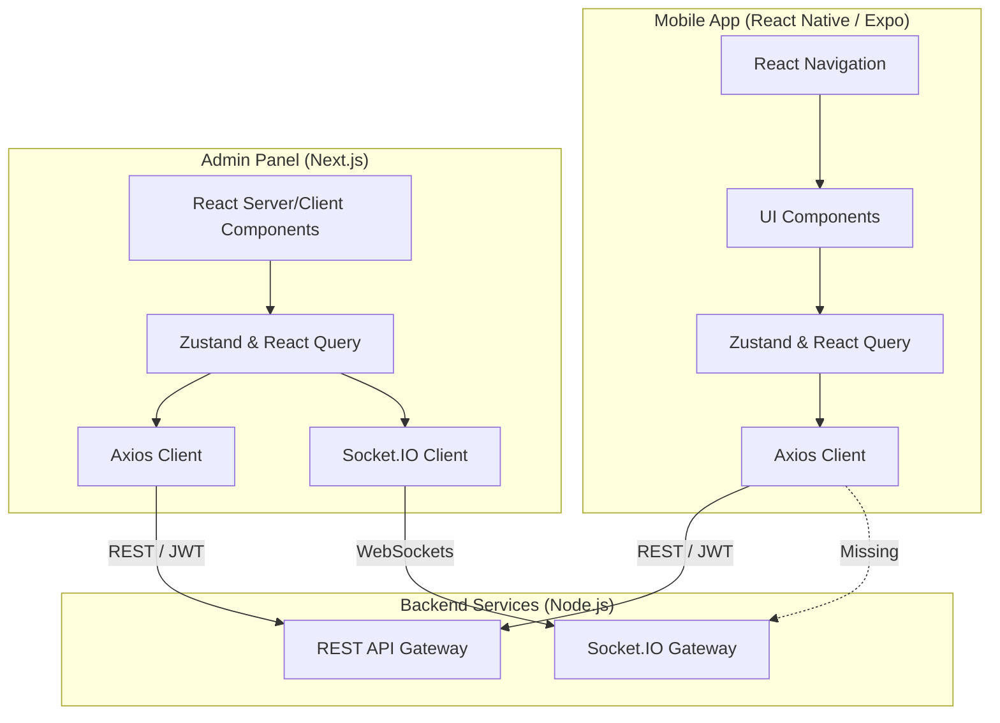

# Frontend Architecture Audit

## 1. Repository Structure

The repository contains two frontend applications separated into distinct directories at the root level.

```text
vikas-inventory-rn/
├── admin-panel/           # Next.js Web Admin Dashboard
│   ├── public/
│   └── src/
│       ├── app/           # Next.js App Router Pages
│       ├── components/    # Reusable UI Components
│       ├── lib/           # Utilities, API Client, Socket Client
│       ├── services/      # API Services
│       ├── store/         # Zustand Stores
│       └── types/         # TypeScript Interfaces
└── Frontend/              # React Native Mobile Application
    ├── assets/
    └── src/
        ├── api/           # API Client (Axios)
        ├── components/    # Shared Components
        ├── context/       # React Contexts
        ├── data/          # Mock data/Constants
        ├── modules/       # Feature-based Modules (auth, order, shop, visit, etc.)
        ├── navigation/    # React Navigation Config & Guards
        ├── screens/       # Legacy/Root Screens
        └── styles/        # Global Styles
```

- **Mobile application location:** `Frontend/`
- **Admin panel location:** `admin-panel/`
- **Web dashboard location:** (Same as admin panel) `admin-panel/`
- **Shared packages:** None. (Applications have completely independent `package.json` dependencies).
- **Shared UI libraries:** None. (No monorepo structure like Turborepo is used to share UI components between web and mobile).
- **Shared utilities:** None.

---

## 2. Frontend Applications

### Application 1: Admin Panel

- **Name:** Admin Panel (`admin-panel`)
- **Purpose:** Web dashboard for distributors to manage inventory, approvals, salesmen, shops, orders, and view analytics.
- **Technology Stack:**
  - Next.js (15.5.19 - App Router)
  - React (19.1.0)
  - TypeScript
  - Tailwind CSS (v4)
  - shadcn/ui & lucide-react
  - Zustand (State Management)
  - React Query (Data Fetching)
  - React Hook Form + Zod (Validation)
  - Socket.IO Client (Realtime)
  - Axios (API Client)
- **Build Commands:** `npm run build` (runs `next build`)
- **Run Commands:** `npm run dev` (runs `next dev`), `npm run start`
- **Environment Variables:**
  - `NEXT_PUBLIC_API_URL`
  - `NEXT_PUBLIC_BACKEND_URL`
  - `NEXT_PUBLIC_SOCKET_URL`
- **Deployment Target:** Vercel, VPS, or any Node.js/Docker hosting compatible with Next.js.

### Application 2: Mobile App

- **Name:** Vikas Inventory RN (`Frontend`)
- **Purpose:** Mobile application for salesmen and field workers to check-in, visit shops, take orders, and manage inventory on the go.
- **Technology Stack:**
  - Expo (49.0.23) / React Native (0.72.10)
  - React (18.2.0)
  - React Navigation v6
  - Zustand (State Management)
  - React Query (Data Fetching)
  - Axios (API Client)
  - React Hook Form + Zod
- **Build Commands:** `expo build` / `eas build`
- **Run Commands:** `npm start` (expo start), `npm run android`, `npm run ios`
- **Environment Variables:**
  - `EXPO_PUBLIC_API_URL`
- **Deployment Target:** Android (Play Store), iOS (App Store)

---

## 3. Mobile Application Architecture

### Navigation System
- **Library:** React Navigation (`@react-navigation/native`, `@react-navigation/native-stack`)
- **Structure:** Uses nested stack and tab navigators located in `Frontend/src/navigation/`. Auth guards are implemented in `Frontend/src/navigation/guards/index.js`.

### Screen Structure
Grouped by feature modules in `Frontend/src/modules/`:

- **Auth**
  - `LoginScreen.js`
  - `RegisterDistributorScreen.js`
  - `RegisterSalesmanScreen.js`
- **Order**
  - `CartReviewScreen.js`
  - `OrderDetailsScreen.js`
  - `OrderRevisionsScreen.js`
  - `ProductCatalogueScreen.js`
- **Pending (Dashboard/Misc)**
  - `CatalogueScreen.js`
  - `DerivedManufacturerScreen.js`
  - `PendingHomeScreen.js`
  - `ProfileScreen.js`
- **Salesman**
  - `SalesmanHomeScreen.js`
- **Shop**
  - `ShopDuplicateCheckScreen.js`
  - `ShopRegistrationScreen.js`
- **Visit**
  - `ActiveVisitScreen.js`
  - `StartVisitScreen.js`

---

## 4. State Management

- **Libraries Used:** Zustand, React Query (TanStack Query)
- **Global Stores:**
  - **Auth Store:** Implemented in both apps (e.g., `admin-panel/src/store/useAuthStore.ts`). Manages JWT tokens (`accessToken`, `refreshToken`) and user profile information.
  - **Cart/Order Store:** Implemented in the mobile app (`Frontend/src/modules/order/store`) to handle highly volatile cart edits instantly.
- **Server State:** Managed entirely by React Query (`@tanstack/react-query`) in both apps, providing caching, background refetching, and offline fallback (in memory) for API data.
- **Persistence Strategy:**
  - In Admin Panel: LocalStorage via Zustand's `persist` middleware.
  - In Mobile App: `AsyncStorage` / `expo-secure-store` used in conjunction with Zustand.

---

## 5. API Layer

### API Client Architecture
- Both frontend applications use **Axios** as the primary HTTP client.
- **Admin Panel:** Defined in `admin-panel/src/lib/api/axios.ts`.
- **Mobile App:** Defined in `Frontend/src/api/client.js`.

### Authentication Flow
- **JWT Handling:** The Axios request interceptor attaches the `accessToken` from the Zustand `useAuthStore` as a `Bearer` token to the `Authorization` header.
- **Refresh Token Handling:** Implemented via Axios response interceptors. On receiving a `401 Unauthorized` error, the client:
  1. Pauses incoming requests (pushing them to a failed queue).
  2. Hits the `/auth/refresh` endpoint with the `refreshToken`.
  3. Updates the Zustand store with new tokens.
  4. Retries the queued requests with the new token.
  5. If refresh fails, it logs the user out.

### Request Lifecycle
1. Component invokes React Query hook or direct service method.
2. Service calls `apiClient`.
3. Request interceptor attaches token.
4. Network request executes.
5. Response interceptor handles 401s or formats data.
6. React Query caches and returns data to the UI.

### Error Handling
- Handled via Axios interceptors. Network errors (`ECONNABORTED`, "Network Error") are caught and mapped to user-friendly messages.

---

## 6. Offline Architecture

### WatermelonDB Structure
- **Status:** **NOT IMPLEMENTED** (Deferred).
- Extensive documentation in `docs/` indicates plans for WatermelonDB to handle offline queues, sync strategies, and data reconciliation. However, source code analysis and phase audit reports confirm that **WatermelonDB integration is deferred to post-V1**.
- The app currently relies on an active internet connection, with minor in-memory caching provided by React Query. Check-ins and orders require active 4G/5G connections.

---

## 7. Realtime Architecture

### Socket.IO Integration
- **Admin Panel Status:** **IMPLEMENTED**
- **Mobile App Status:** **NOT IMPLEMENTED**

**Admin Panel Realtime (`admin-panel/src/lib/socket/`)**
- **Connection Lifecycle:** Managed by `SocketProvider` (`socket-provider.tsx`), which connects `socket.io-client` on mount and cleans up on unmount.
- **Events Listened/Emitted:** Tracked in `socket-events.ts`:
  - `ORDER_STATUS_CHANGED`, `BACKORDER_CREATED`, `VISIT_STARTED`, `VISIT_ENDED`, `NOTIFICATION_CREATED`, `NOTIFICATION_READ`, `SALESMAN_CHECKED_IN`, `SALESMAN_CHECKED_OUT`, `backorder:allocated`, `inventory:updated`, `backorder:resolved`, `LOCATION_UPDATED`, `APPROVAL_STATUS_CHANGED`, `NEW_ORDER`, `ORDER_EDITED`, `ORDER_CANCELLED`.
- **Reconnection Strategy:** Relies on default `socket.io-client` auto-reconnection parameters.

---

## 8. Push Notification Architecture

### Firebase Integration
- **Status:** **NOT IMPLEMENTED in Frontend source.**
- A search for Firebase/FCM related code in the `Frontend` directory yields no results. Push notification handlers, deep linking, background, and foreground notification integrations are currently missing in the React Native codebase, although the backend has a `firebase-notification` module.

---

## 9. Admin Panel Architecture

- **Framework:** Next.js 15 (App Router)
- **Folder Structure:** Feature-based routing in `src/app/`. Components split into `src/components/ui/` (shadcn) and domain-specific components (`auth`, `dashboard`, `shared`).
- **Routing:** 
  - `(auth)/login`
  - `(dashboard)/dashboard`
  - `(dashboard)/approvals`
  - `(dashboard)/manufacturers`
  - `(dashboard)/products`
  - `(dashboard)/salesmen`
  - `(dashboard)/shops`
- **Authentication:** JWT via Zustand + Next.js Middleware (`src/middleware.ts`) for route protection.
- **API Integration:** Axios + React Query. API layer abstracted into `src/services/` (e.g., `product.service.ts`).
- **Role Based Access:** Guarded primarily by API tokens. Middleware checks for auth presence.
- **Implemented Modules:** Auth, Dashboard, Approvals, Manufacturers, Products, Salesmen, Shops.
- **Missing Modules:** Settings, User Profile Management.

---

## 10. UI Design System

### Component Library
- **Admin Panel:** Uses **shadcn/ui** overlaid on Tailwind CSS v4.
- **Mobile App:** Uses custom styling, `react-native-safe-area-context`, and `react-native-vector-icons`. No major overarching UI framework (like NativeBase or Tamagui) is installed.

### Shared Components
- **Admin Panel:** Extensively uses `src/components/ui/` for buttons, inputs, tables, dialogs, etc.
- **Mobile App:** Basic shared components are in `Frontend/src/components/`.

### Forms & Validation
- **Both Applications:** Standardized on **React Hook Form** coupled with **Zod** schema validation (`@hookform/resolvers`). Admin Panel schemas are centrally located in `src/lib/validation/`.

### Theme System & Dark Mode
- **Admin Panel:** Tailwind CSS configuration supports theming. `next-themes` isn't explicitly visible, but shadcn/ui provides standard dark mode CSS variables.
- **Mobile App:** Hardcoded styles or basic Context API. No explicit advanced dark mode implementation found.

### Responsive Strategy
- **Admin Panel:** Tailwind CSS utility classes (`sm:`, `md:`, `lg:`) are used for responsive web design.
- **Mobile App:** Flexbox layouts standard to React Native.

---

## 11. Security Architecture

- **Auth Guards:** 
  - Admin Panel: `src/middleware.ts` intercepts protected routes and redirects unauthenticated users.
  - Mobile App: React Navigation flow guards prevent accessing authenticated stacks without tokens.
- **Token Storage:**
  - Admin Panel: Local Storage via Zustand persist.
  - Mobile App: `expo-secure-store` is listed in dependencies, implying secure encrypted storage for JWTs.
- **Sensitive Data Handling:** Environment variables used for API URLs. No hardcoded secrets found in source.

---

## 12. Build & Release Process

### Android & iOS Build Process
- Handled via Expo tooling (`expo-cli`).
- `eas.json` is present in `Frontend/`, indicating Expo Application Services (EAS) is configured for cloud building of `.apk`/`.aab` and `.ipa` artifacts.

### Environment Configuration
- Uses standard `.env` / `.env.local` files for Admin Panel.
- Expo uses `EXPO_PUBLIC_` prefixed environment variables.

### Release Configuration
- Not thoroughly configured locally; relies on EAS standard production profiles.

---

## 13. Frontend Feature Completion Matrix

| Module | Exists | Fully Implemented | Partial | Missing |
| ------ | ------ | ----------------- | ------- | ------- |
| Mobile Auth | Yes | Yes | - | - |
| Admin Auth | Yes | Yes | - | - |
| Mobile Offline Sync | No | - | - | Yes (WatermelonDB) |
| Mobile Push Notifications | No | - | - | Yes (Firebase) |
| Mobile Orders / Cart | Yes | Yes | - | - |
| Mobile Visit Check-ins | Yes | Yes | - | - |
| Mobile Realtime Sockets | No | - | - | Yes |
| Admin Realtime Sockets | Yes | Yes | - | - |
| Admin Dashboard | Yes | Yes | - | - |
| Admin Approvals | Yes | Yes | - | - |
| Admin Inventory/Products| Yes | Yes | - | - |
| Admin Salesmen | Yes | Yes | - | - |
| Admin Shops | Yes | Yes | - | - |

---

## 14. Deployment Assessment

### Can any frontend be hosted on Vercel?

| Application | Deployment Platform | Reason |
| ----------- | ------------------- | ------ |
| `admin-panel` | Vercel Compatible | It is a standard Next.js application using standard build processes (`next build`). It relies on standard browser APIs and Axios, making it fully edge and serverless compatible. |
| `Frontend` | Not Vercel | It is a React Native mobile application built with Expo. It compiles to native Android/iOS binaries, requiring App Store/Play Store distribution (or EAS distribution), not a web server. |

---

## 15. Vercel Readiness Report (Admin Panel)

- **Current status:** High readiness.
- **Missing env variables:** `NEXT_PUBLIC_API_URL`, `NEXT_PUBLIC_BACKEND_URL`, and `NEXT_PUBLIC_SOCKET_URL` must be set in Vercel project settings.
- **Build blockers:** None apparent. Ensure ESLint and TypeScript compilation pass.
- **Runtime blockers:** None. Next.js App Router and Zustand are fully supported.
- **Required changes:** None required architecturally. 
- **Estimated deployment readiness:** Ready to deploy immediately.

---

## 16. Final Architecture Diagram


